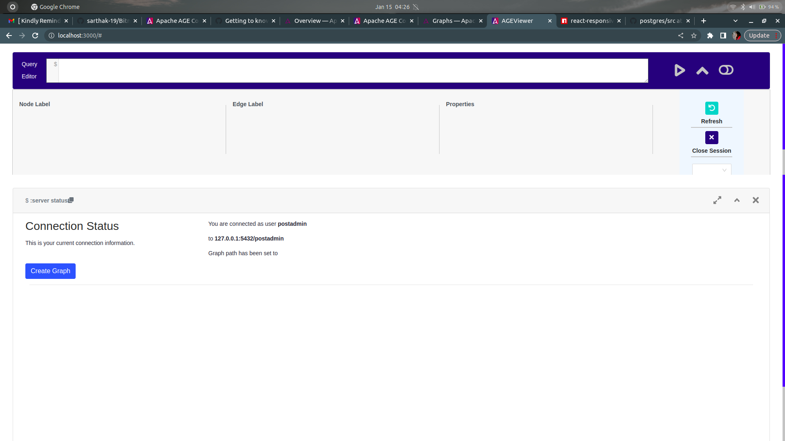

## AGE Viewer
Forked from: https://github.com/apache/age-viewer

### Improvements in UI
	1. Responsive resizing of components
	2. Improve display of components so that no content is cut/trimmed (initially content was not being rendered properly)

### Development Environment
Linux Ubuntu 20.04

### Visual Comparison
#### After

#### Before

